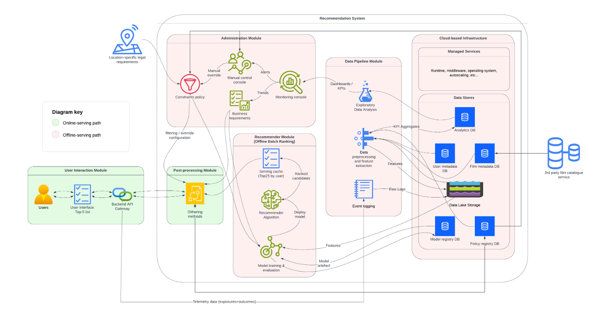

# Policy-controlled film recommendation serving demo

The system design began as coursework for the AI Systems Engineering module in my MSc Artificial Intelligence. The assessed work focused on the theory: defining the system goals, designing the architecture and explaining how it would be deployed and monitored. An implementation was not required.

I built this repository separately to show that I could translate part of that design into working code. It is an executable companion to the film information and recommendation platform described in the coursework, rather than the coursework submission itself. The written design asks how a small entrant could differentiate itself through useful discovery, without putting an expensive recommender on the request path or allowing novelty to override relevance. I have not included the essay, so this README supplies the missing context.

I kept the code narrow. It tests one claim from that design: a cached list of 25 candidates can be filtered, assigned to a versioned policy and reranked into the five films shown to a user. The base recommender is treated as a black box, which keeps the demonstration focused on the system around the model. Hulten (2018) describes this distinction between model performance and the behaviour of the wider intelligent system.

## What this project demonstrates

- deterministic stand-ins for offline, per-user top-25 candidate snapshots;
- request-time filtering for regional availability;
- a policy-controlled reranker that trades some relevance weight for novelty and long-tail exposure;
- stable assignment to baseline and experimental policy versions;
- a switch that bypasses reranking and returns the filtered baseline;
- tests around determinism, constraints, rollout boundaries and the five-item serving contract.

The separation between cached candidates and lightweight online reranking reflects the offline/online pattern discussed by Amatriain (2012). The post-ranking module is inspired by Liu, Wang and Bhuiyan's (2022) use of an independently configurable reranker for multiple objectives.

## Where the demo sits in the system design



The complete diagram includes model training, telemetry, data stores, monitoring and administration. This repository implements only the serving slice across its centre-left edge:

| Diagram label | Code | What the demo represents |
|---|---|---|
| **Serving cache (Top25 by user)** | `candidates.py` and `CandidateSnapshot` | A deterministic synthetic substitute for the cached output of the offline recommender. |
| **Constraints policy** and **filtering / override configuration** | `constraints.py` | Regional availability is applied after base ranking but before request-time reranking and top-five selection. |
| **Policy registry DB** and the governed rollout path | `config/policy-*.yaml` and `rollout.py` | Local YAML files stand in for versioned policy artefacts; stable user buckets provide a small canary-style rollout mechanism. |
| **Post-processing Module: Dithering methods** | `reranker.py` | Eligible candidates are rescored using relevance, novelty, long-tail and repeat terms. |
| **Backend API Gateway** to **User Interface: Top-5 list** | `serving.py` | The selected policy is applied and exactly five candidates are returned, with a baseline fallback when reranking is disabled. |

The synthetic candidate generator is not a trained recommendation model, and the function in `serving.py` is not a deployed API. The data pipeline, outcome telemetry, KPI aggregation, model registry, monitoring console and cloud infrastructure shown in the diagram remain design components rather than code in this repository.

## Decisions, rationale and implemented maths

All four candidate attributes used by the reranker are scaled to the interval $[0,1]$ in the demo. They are policy inputs, not validated estimates of user satisfaction. Beyond-accuracy measures such as novelty and long-tail coverage are useful because relevance alone can concentrate recommendations around familiar, popular items (Abdollahpouri, Burke and Mobasher, 2017; Duricic et al., 2023).

The maths is intentionally simple. Each term corresponds directly to a line of code:

| Decision | Rationale | Implemented definition | Location and caveat |
|---|---|---|---|
| Generate a repeatable top-25 snapshot | The serving path needs a fixed input without pretending to implement the unspecified base model. A model or refresh change should produce a different artefact. | Let $k$ be the user ID, model version and refresh ID joined with the ASCII vertical-bar separator. Then $seed=\operatorname{int}(\operatorname{SHA256}(k)[0{:}8],16)$; 25 candidates are sorted by decreasing synthetic relevance. | `candidates.py`. The values are generated test data, not predictions. |
| Apply constraints before reranking | An unavailable film must not regain eligibility through a high score. Failing when fewer than five items remain makes the serving contract explicit. | $C_R=\{i\in C:R\in A_i\}$, where $A_i$ is item $i$'s regional availability set. | `constraints.py` and `serving.py`. Only a regional rule is modelled. |
| Keep relevance as the main positive term | The experiment is intended to widen discovery, not replace the base ranker's view of likely relevance. | $r_i\in[0,1]$ is supplied by the candidate snapshot. | `models.py`. It is sampled in this demo rather than learnt or calibrated. |
| Give unseen items a novelty indicator | A binary term makes the effect of recent history easy to inspect. | $n_i=1-\mathbb{1}[\text{recently seen}_i]$. | `reranker.py`. This is a coarse proxy; it does not measure semantic unexpectedness. |
| Reward less popular candidates | Inverting normalised popularity creates a simple long-tail term and exposes the accuracy/coverage trade-off discussed by Abdollahpouri, Burke and Mobasher (2017). | $\ell_i=1-p_i$, where $p_i\in[0,1]$ is normalised popularity. | `reranker.py`. Production use would require a defined time window and population for $p_i$. |
| Penalise repetition more strongly after consumption | A seen item receives the full repeat penalty; a merely recommended item receives half. | $q_i=\max\{\mathbb{1}[\text{seen}_i],\;0.5\,\mathbb{1}[\text{recommended}_i]\}$. | `reranker.py`. The two binary history flags are synthetic. |
| Combine the objectives in a policy score | A linear score makes the policy legible and allows weight changes without changing the base recommender. | $s_i=w_r r_i+w_n n_i+w_\ell\ell_i-w_q q_i$. Candidates are sorted by decreasing $s_i$. | `reranker.py` and `config/`. The weights express a serving policy; they are not fitted coefficients. |
| Assign users through a stable rollout bucket | A user's bucket is repeatable for a fixed rollout fraction. Increasing the fraction creates nested cohorts: existing experimental users stay there, whilst some baseline users move into the experiment. | $b_u=\operatorname{int}(\operatorname{SHA256}(u)[0{:}8],16)/2^{32}$; use the experimental policy when $b_u<f$. | `rollout.py`. This is deterministic bucketing, not random assignment with inferential guarantees. |
| Preserve a baseline fallback | Policy code should be bypassable without recomputing the cached candidate list. | If reranking is disabled, return the first five members of $C_R$ in base relevance order. | `serving.py`. A production service would also record the fallback and alert operators. |

The two checked-in policies make the intended comparison concrete:

| Weight | `policy-v1` (conservative) | `policy-v2` (discovery) |
|---|---:|---:|
| Relevance, $w_r$ | 0.950 | 0.700 |
| Novelty, $w_n$ | 0.025 | 0.150 |
| Long-tail, $w_\ell$ | 0.025 | 0.250 |
| Repeat penalty, $w_q$ | 0.000 | 0.200 |

These scores are suitable for checking control flow and rank changes. They do not demonstrate that the discovery policy improves engagement, serendipity or retention. That would require logged exposures and outcomes, a defined evaluation window, and controlled online analysis.

## Install and run the tests

Python 3.11 or later is required.

```bash
python3 -m venv .venv
source .venv/bin/activate
python -m pip install -e ".[dev]"
python -m pytest
```

The serving path can also be exercised directly:

```python
from recommender_demo.candidates import get_candidate_snapshot
from recommender_demo.config import load_policy
from recommender_demo.serving import serve_recommendations

snapshot = get_candidate_snapshot(
    user_id="demo-user",
    model_version="model-0.1",
    candidate_refresh_id="refresh-001",
)

recommendations = serve_recommendations(
    snapshot=snapshot,
    region="UK",
    baseline_policy=load_policy("config/policy-v1.yaml"),
    experimental_policy=load_policy("config/policy-v2.yaml"),
    experimental_fraction=0.1,
)

for candidate in recommendations:
    print(candidate.item_id, candidate.genre)
```

## Repository structure

```text
.
├── assets/                 # System diagram used by this README
├── config/                 # Versioned baseline and discovery policies
├── src/recommender_demo/   # Candidate, constraint, rollout and serving code
├── tests/                  # Behavioural tests for the demonstrator
├── LICENSE
└── pyproject.toml
```

## Limitations

- Candidate relevance, popularity, history and availability are synthetic.
- Regional membership is the only implemented constraint; there is no rights catalogue or manual override service.
- There is no user interface, API server, persistence, event logging, model training or monitoring pipeline.
- The reranker has no diversity term between items, even though diversity is part of the wider design.
- Policy weights have not been tuned against user outcomes.
- Hash bucketing stabilises assignment but does not replace experimental design, exposure logging or statistical analysis.

## References

Abdollahpouri, H., Burke, R. and Mobasher, B., 2017. [Controlling popularity bias in learning-to-rank recommendation](https://doi.org/10.1145/3109859.3109912). *Proceedings of the 11th ACM Conference on Recommender Systems*, pp. 42-46.

Amatriain, X., 2012. [Building industrial-scale real-world recommender systems](https://doi.org/10.1145/2365952.2365958). *Proceedings of the Sixth ACM Conference on Recommender Systems*, pp. 7-8.

Duricic, T., Kowald, D., Lacic, E. and Lex, E., 2023. [Beyond-accuracy: a review on diversity, serendipity, and fairness in recommender systems based on graph neural networks](https://doi.org/10.3389/fdata.2023.1251072). *Frontiers in Big Data*, 6, 1251072.

Hulten, G., 2018. [*Building intelligent systems: a guide to machine learning engineering*](https://link.springer.com/book/10.1007/978-1-4842-3432-7). Berkeley, CA: Apress.

Liu, X., Wang, G. and Bhuiyan, M.Z.A., 2022. [Re-ranking with multiple objective optimization in recommender system](https://doi.org/10.1002/ett.4398). *Transactions on Emerging Telecommunications Technologies*, 33(1), e4398.

## Licence

The code and documentation are available under the [MIT License](LICENSE).
